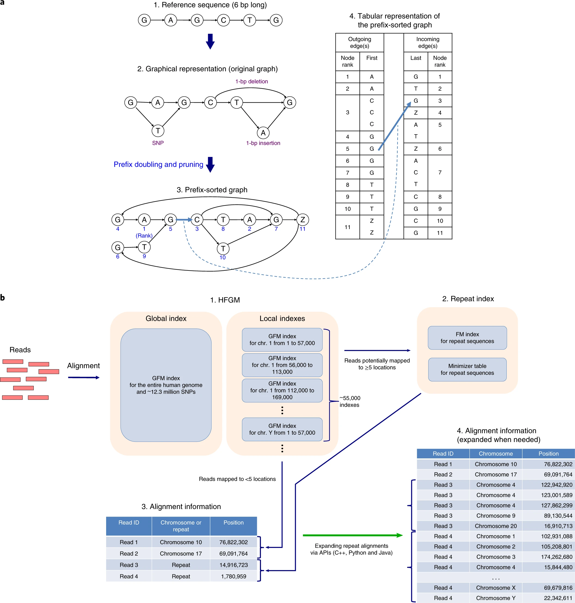

# HISAT2

## Contact

[Daehwan Kim](https://kim-lab.org) (infphilo@gmail.com) and [Chanhee Park](https://www.linkedin.com/in/chanhee-park-97677297/) (parkchanhee@gmail.com)

## Overview
HISAT2 is a fast and sensitive alignment program for mapping next-generation sequencing reads (whole-genome,
transcriptome, and exome sequencing data) to a population of human genomes (as well as to a single reference genome).
Based on an extension of BWT for a graph [1], we designed and implemented a graph FM index (GFM), an original approach
and its first implementation to the best of our knowledge. In addition to using one global GFM index that represents
general population, HISAT2 uses a large set of small GFM indexes that collectively cover the whole genome (each index
representing a genomic region of 56 Kbp, with 55,000 indexes needed to cover human population). These small indexes
(called local indexes) combined with several alignment strategies enable effective alignment of sequencing reads.
This new indexing scheme is called Hierarchical Graph FM index (HGFM). We have developed HISAT2 based on the HISAT
[2] and Bowtie 2 [3] implementations.  See the [HISAT2 website](https://daehwankimlab.github.io/hisat2/) for
more information.

Getting started
============
HISAT2 requires a 64-bit computer running either Linux or Mac OS X and at least 8 GB of RAM.

A few notes:
1) HISAT2's index (HGFM) size for the human reference genome and 12.3 million common SNPs is 6.2 GB. The SNPs consist of 11 million single nucleotide polymorphisms, 728,000 deletions, and 555,000 insertions. Insertions and deletions used in this index are small (usually <20bp). We plan to incorporate structural variations (SV) into this index.
2) The memory footprint of HISAT2 is relatively low, 6.7 GB.
3) The runtime of HISAT2 is estimated to be slightly slower than HISAT (30–100% slower for some data sets).
4) HISAT2 provides greater accuracy for alignment of reads containing SNPs.
5) Use [HISAT-3N](https://daehwankimlab.github.io/hisat2/hisat-3n/) to align nucleotide converted sequencing reads
   include [BS-seq], [SLAM-seq], [scBS-seq], [scSLAM-seq], [TAB-seq], [oxBS-seq], [TAPS] and [EM-seq].
   This alignment process requires about 10 GB of RAM.
6) HISAT2 repository is seperated with HISAT-genotype repository.
   Please see the link below for [HISAT-genotype repository](https://github.com/DaehwanKimLab/hisat-genotype)
   and [HISAT-genotype homepage](https://daehwankimlab.github.io/hisat-genotype/).

## Install
    git clone https://github.com/DaehwanKimLab/hisat2.git
    cd hisat2
    make

Usage
============
## Building an index
`hisat2-build` builds a HISAT2 index from a set of DNA sequences. `hisat2-build` outputs a set of 6 files with
suffixes `.1.ht2`, `.2.ht2`, `.3.ht2`, `.4.ht2`, `.5.ht2`, `.6.ht2`, .`7.ht2`, and `.8.ht2`.
In the case of a large index these suffixes will have a `ht2l` termination.
These files together constitute the index: they are all that is needed to align reads to that reference.
The original sequence FASTA files are no longer used by HISAT2 once the index is built.

Example for HISAT2 index building:

    hisat2-build genome.fa genome

## Alignment with HISAT2

Examples alignment with HISAT2:

    # for single-end FASTA reads alignment
    hisat2 -f -x genome -U reads.fa -S output.sam

    # for paired-end FASTQ reads alignment
    hisat2 -x genome -1 reads_1.fq -2 read2_2.fq -S output.sam

## For more information, see the following websites:
* [HISAT2 website](https://daehwankimlab.github.io/hisat2)
* [HISAT-3N website](https://daehwankimlab.github.io/hisat2/hisat-3n/)

## License

[GPL-3.0](LICENSE)

## References

[1] Sirén J, Välimäki N, Mäkinen V (2014) Indexing graphs for path queries with applications in genome research. IEEE/ACM Transactions on Computational Biology and Bioinformatics 11: 375–388. doi: 10.1109/tcbb.2013.2297101

[2] Kim D, Langmead B, and Salzberg SL  HISAT: a fast spliced aligner with low memory requirements, Nature methods, 2015

[3] Langmead B, Salzberg SL: Fast gapped-read alignment with Bowtie 2. Nat Methods 2012, 9:357-359

[HISAT2]:https://github.com/DaehwanKimLab/hisat2
[BS-seq]: https://en.wikipedia.org/wiki/Bisulfite_sequencing
[SLAM-seq]: https://www.nature.com/articles/nmeth.4435
[scBS-seq]: https://www.nature.com/articles/nmeth.3035
[scSLAM-seq]: https://www.nature.com/articles/s41586-019-1369-y
[TAPS]: https://www.nature.com/articles/s41587-019-0041-2
[oxBS-seq]: https://science.sciencemag.org/content/336/6083/934
[TAB-seq]: https://www.cell.com/fulltext/S0092-8674%2812%2900534-X
[EM-seq]: https://genome.cshlp.org/cgi/content/long/gr.266551.120

Publication
============
* ### HISAT2 and HISAT-genotype
  Kim, D., Paggi, J.M., Park, C. et al. [Graph-based genome alignment and genotyping with HISAT2 and HISAT-genotype](https://www.nature.com/articles/s41587-019-0201-4). Nat Biotechnol 37, 907–915 (2019)

* ### HISAT-3N
  Zhang, Y., C. Park, C. Bennett, M. Thornton and D. Kim [Rapid and accurate alignment of nucleotide conversion sequencing reads with HISAT-3N](https://doi.org/10.1101/gr.275193.120) Genome Research 31(7): 1290-1295 (2021)
  

