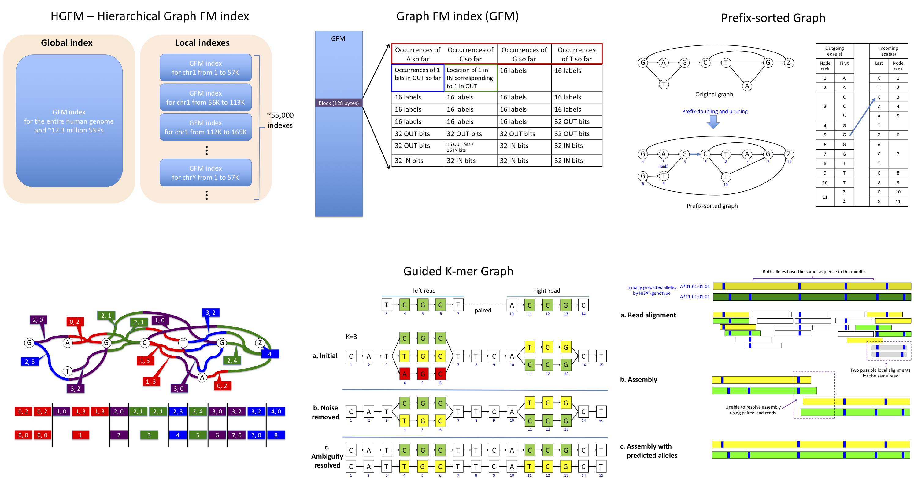

# Graph-Based Genome Alignment and Genotyping with HISAT2 and HISAT-genotype

## Contact

[Daehwan Kim](https://kim-lab.org) (infphilo@gmail.com) and [Chanhee Park](https://www.linkedin.com/in/chanhee-park-97677297/) (parkchanhee@gmail.com)

## Abstract

Rapid advances in next-generation sequencing technologies have dramatically changed our ability to perform genome-scale analyses. The human reference genome used for most genomic analyses represents only a small number of individuals, limiting its usefulness for genotyping. We designed a novel method, HISAT2, for representing and searching an expanded model of the human reference genome, in which a large catalogue of known genomic variants and haplotypes is incorporated into the data structure used for searching and alignment. This strategy for representing a population of genomes, along with a fast and memory-efficient search algorithm, enables more detailed and accurate variant analyses than previous methods. We demonstrate two initial applications of HISAT2: HLA typing, a critical need in human organ transplantation, and DNA fingerprinting, widely used in forensics. These applications are part of HISAT-genotype, with performance not only surpassing earlier computational methods, but matching or exceeding the accuracy of laboratory-based assays.

For more information, see the following websites:
* [HISAT2 website](http://ccb.jhu.edu/software/hisat2)
* [HISAT-genotype website](http://ccb.jhu.edu/software/hisat-genotype)

## HISAT2
HISAT2 is a fast and sensitive alignment program for mapping next-generation sequencing reads (whole-genome, transcriptome, and exome sequencing data) to a population of human genomes (as well as to a single reference genome). Based on an extension of BWT for a graph [1], we designed and implemented a graph FM index (GFM), an original approach and its first implementation to the best of our knowledge. In addition to using one global GFM index that represents general population, HISAT2 uses a large set of small GFM indexes that collectively cover the whole genome (each index representing a genomic region of 56 Kbp, with 55,000 indexes needed to cover human population). These small indexes (called local indexes) combined with several alignment strategies enable effective alignment of sequencing reads. This new indexing scheme is called Hierarchical Graph FM index (HGFM). We have developed HISAT2 based on the HISAT [2] and Bowtie 2 [3] implementations.  See the [HISAT2 website](http://ccb.jhu.edu/software/hisat2/index.shtml) for
more information.

A few notes:

1) HISAT2's index (HGFM) size for the human reference genome and 12.3 million common SNPs is 6.2GB. The SNPs consist of 11 million single nucleotide polymorphisms, 728,000 deletions, and 555,000 insertions. Insertions and deletions used in this index are small (usually <20bp). We plan to incorporate structural variations (SV) into this index.

2) The memory footprint of HISAT2 is relatively low, 6.7GB.

3) The runtime of HISAT2 is estimated to be slightly slower than HISAT (30–100% slower for some data sets).

4) HISAT2 provides greater accuracy for alignment of reads containing SNPs.

5) We released a first (beta) version of HISAT2 in September 8, 2015.

## License

[GPL-3.0](LICENSE)

# For reviwers, follow the instructions below to reproduce some of the results in the manuscript.

## Code

A specific version of [HISAT2 and HISAT-genotype](http://github.com/infphilo/hisat2) at GitHub is used (a branch name: hisat2_v2.2.0_beta).

## Initial setup

HISAT-genotype requires a 64-bit computer running either Linux or Mac OS X and at least 8 GB of RAM (16 GB of RAM is preferred). All the commands used should be run from the Unix shell prompt within a terminal window and are prefixed with a '$' character.

We refer to <b>hisat-genotype-top</b> as our top directory where all of our programs are located. <b>hisat-genotype-top</b> is a place holder that can be changed to another name according to user preference.
Run the following commands to install HISAT2 and HISAT-genotype.
    
    $ git clone https://github.com/infphilo/hisat2 hisat-genotype-top
    $ cd hisat-genotype-top
    hisat-genotype-top$ git checkout hisat2_v2.2.0_beta
    hisat-genotype-top$ make hisat2-align-s hisat2-build-s hisat2-inspect-s
    
To make the binaries built above and other python scripts available everywhere, add the hisat-genotype-top directory to the PATH environment variable (e.g. ~/.bashrc) 

    export PATH=hisat-genotype-top:hisat-genotype-top/hisatgenotype_scripts:$PATH
    export PYTHONPATH=hisat-genotype-top/hisatgenotype_modules:$PYTHONPATH

To reflect the change, run the following command:
    
    $ source ~/.bashrc

Download real reads, simulated reads, and HISAT2 indexes, then move them into appropriate directories:
 
    hisat-genotype-top$ cd evaluation
    hisat-genotype-top/evaluation$ wget ftp://ftp.ccb.jhu.edu/pub/infphilo/hisat2/data/hisat2_20181025.tar.gz
    hisat-genotype-top/evaluation$ tar xvzf hisat2_20181025.tar.gz
    hisat-genotype-top/evaluation$ mkdir aligners aligners/bin; cd aligners/bin; ln -s ../../../hisat2* .; cd ../..
    hisat-genotype-top/evaluation$ mv hisat2/* .
    hisat-genotype-top/evaluation$ cd simulation; ./init.py; cd ../real; ./init.py; cd ..
    
## Run HISAT2 on the following simulated and real data sets.
###	10 million simulated read pairs with SNPs and with sequencing errors
    
    hisat-genotype-top/evaluation$ cd simulation/10M_DNA_mismatch_snp_reads_genome
    hisat-genotype-top/evaluation/simulation/10M_DNA_mismatch_snp_reads_genome$ ./calculate_read_cost.py --aligner-list hisat2 --paired-end --fresh
    
### 10 million simulated read pairs with SNPs and without sequencing errors
 
    hisat-genotype-top/evaluation$ cd simulation/10M_DNA_snp_reads_genome
    hisat-genotype-top/evaluation/simulation/10M_DNA_snp_reads_genome$ ./calculate_read_cost.py --aligner-list hisat2 --paired-end --fresh

### 10 million simulated read pairs without SNPs and with sequencing errors
    hisat-genotype-top/evaluation$ cd simulation/10M_DNA_mismatch_reads_genome
    hisat-genotype-top/evaluation/simulation/10M_DNA_mismatch_reads_genome$ ./calculate_read_cost.py --aligner-list hisat2 --paired-end --fresh

### 10 million simulated read pairs without SNPs and without sequencing errors
    hisat-genotype-top/evaluation$ cd simulation/10M_DNA_genome
    hisat-genotype-top/evaluation/simulation/10M_DNA_snp_$ ./calculate_read_cost.py --aligner-list hisat2 --paired-end --fresh

### 10 million real read pairs
    hisat-genotype-top/evaluation$ cd real/DNA
    hisat-genotype-top/evaluation/real/DNA ./calculate_read_cost.py --aligner-list hisat2 --paired-end --fresh

### Interpreting output
    Example alignment output for simulated reads
    aligned: 1000000, multi aligned: 2654390
		    correctly mapped: 999963 (100.00%)
		    uniquely and correctly mapped: 967631 (96.76%)
			    54694 reads per sec (all)
			    Memory Usage: 86MB

The above lines show that 1,000,000 read pairs are aligned and the total number of alignments is 2,654,390. 999,963 pairs (100.00%) are correctly aligned (e.g. one of the alignments is correct). 967,631 (96.76%) pairs are uniquely and correctly aligned. HISAT2 aligns 54,594 reads with a peak memory usage of 86 MB of RAM. 

Each run is expected to take up to several hours mostly due to the comparison of HISAT2’s reported alignments and true alignments and the expansion of repeat alignments.

## Details on HISAT-genotype run for HLA typing and assembly

To create a directory where we perform our analysis for HLA typing and assembly, which here is referred to as hla-analysis but can be changed by the user, execute the following command.
    
    hisat-genotype-top/evaluation$ mkdir hla-analysis

The current directory can be changed to hla-analysis as follows:
    
    hisat-genotype-top/evaluation$ cd hla-analysis

Additional program requirements: SAMtools (version 1.3 or later)

### Downloading a Graph Reference and Index
The graph reference we are going to build incorporates variants of numerous HLA alleles into the linear reference using a graph. The graph reference also includes some known variants of other regions of the genome (e.g. common small variants). To copy the graph reference, type:

    hisat-genotype-top/evaluation/hla-analysis$ mv ../hisat2-genotype/* .

### Read Extraction
Since whole genome sequencing (WGS) data includes reads that are from the whole genome, the first step is to extract the reads that belong to the HLA genes by aligning them to the graph reference with HISAT2. The graph reference enables substantially more sensitive alignment compared to the linear reference (e.g. based on our experiment, for read extraction, we got twice as many reads than from using the reference only.)

    hisat-genotype-top/evaluation/hla-analysis$ hisatgenotype_extract_reads.py --base genotype_genome --read-dir ILMN_20181025 --out-dir ILMN
, where ILMN_20181025 contains read files as follows. Please make sure that your files end with 1.fq.gz or 2.fq.gz.
 NA12892.hla.extracted.1.fq.gz
 NA12892.hla.extracted.2.fq.gz
 NA12878.hla.extracted.1.fq.gz
 NA12878.hla.extracted.2.fq.gz

Alternatively, we provide these extracted reads in hisat-genotype-top/evaluation/hisat-genotype/ILMN_20181025.

### Typing and Assembly
HISAT-genotype performs both HLA typing and assembly as follows.
You can perform HLA typing and assembly for HLA-A gene on sequencing reads from the genome NA12892 (Illumina's HiSeq 2000 platform).

    hisat-genotype-top/evaluation/hla-analysis$ hisatgenotype_locus.py --base hla --locus-list A --assembly -1 ILMN_20181025/NA12892.hla.extracted.1.fq.gz -2 ILMN_20181025/NA12892.hla.extracted.2.fq.gz

### DNA Fingerprinting
This function can be performed with the same commands used for “Typing and Assembly” and just replacing --base hla with --base codis.

### Interpreting Output
    Typing Output
    Number of reads aligned: 1507
      1 A*02:01:01:02L (count: 571)
      2 A*02:01:31 (count: 557)
      3 A*02:20:02 (count: 557)
      4 A*02:29 (count: 557)
      5 A*02:321N (count: 556)
      6 A*02:372 (count: 556)
      7 A*02:610:02 (count: 556)
      8 A*02:249 (count: 555)
      9 A*02:479 (count: 555)
      10 A*02:11:01 (count: 554)

The above lines show the top ten alleles that the most number of reads are mapped to or compatible with. For example, the allele first ranked, A\*02:01:01:02L, is compatible with 571 reads. This raw estimate based on the number of reads should not be used to determine the two true alleles because the alleles that resemble both but are not true alleles often tend to be compatible with more reads than either of the true alleles. Thus, we apply a statistical model to identify the two true alleles as described in the main text.

    Abundance of alleles
      1 ranked A*02:01:01:01 (abundance: 54.32%)
      2 ranked A*11:01:01:01 (abundance: 45.20%)
      3 ranked A*24:33 (abundance: 0.48%)

The above rankings show the top three alleles that are most abundant in the sample. Normally, the top two alleles in this estimate (e.g. A\*02:01:01:01 and A\*11:01:01:01) are considered as the two alleles that best match a given sequencing data.

Additional tutorials and details are available at the HISAT-genotype website: https://ccb.jhu.edu/hisat-genotype 

## Data

The Data directory (`/data`) contains all input files for reproducing some of our results such as from the 
evaluation of HISAT2 and other programs using both simulated and real reads, from typing and assembling
HLA genes of Illumina Platinum Genomes using HISAT-genotype, and from building a HISAT2 graph index.

* **Simulated read pairs**

| Type | Number of pairs | Path |
| - | - | - |
| SNPs and sequencing errors included | 10,000,000 | hisat-genotype-top/evaluation/reads/simulation/10M_DNA_mismatch_snp_reads_genome |
| SNPs included | 10,000,000 | hisat-genotype-top/evaluation/reads/simulation/10M_DNA_snp_reads_genome |
| Sequencing errors included | 10,000,000 | hisat-genotype-top/evaluation/reads/simulation/10M_DNA_mismatch_reads_genome |
| No SNPs nor sequencing errors included | 10,000,000 | hisat-genotype-top/evaluation/reads/simulation/10M_DNA_reads_genome |

Each directory comes with a true alignment file in SAM format so that users know where the reads were generated in the human reference genome.

* **Real read pairs**

| Number of read pairs | Path |
| - | - |
| 10,000,000 | hisat-genotype-top/evaluation/reads/real/DNA |

* **Human reference genome, SNPs, haplotypes, and HISAT2's indexes**

| Type | Path |
| - | - |
| GRCh38 reference | hisat-genotype-top/evaluation/data/genome.fa |
| SNPs | hisat-genotype-top/evaluation/data/genome.snp |
| Haplotypes | hisat-genotype-top/evaluation/data/genome.haplotype |
| HISAT2's prebuilt graph index for comparison with other aligners | hisat-genotype-top/evaluation/indexes/HISAT2/genome.[1-8].ht2 |
| HISAT2's prebuilt graph index for genotyping | hisat-genotype-top/evaluation/hla-analysis/genotype_genome.[1-8].ht2 |

## References

[1] Sirén J, Välimäki N, Mäkinen V (2014) Indexing graphs for path queries with applications in genome research. IEEE/ACM Transactions on Computational Biology and Bioinformatics 11: 375–388. doi: 10.1109/tcbb.2013.2297101

[2] Kim D, Langmead B, and Salzberg SL  HISAT: a fast spliced aligner with low memory requirements, Nature methods, 2015

[3] Langmead B, Salzberg SL: Fast gapped-read alignment with Bowtie 2. Nat Methods 2012, 9:357-359
